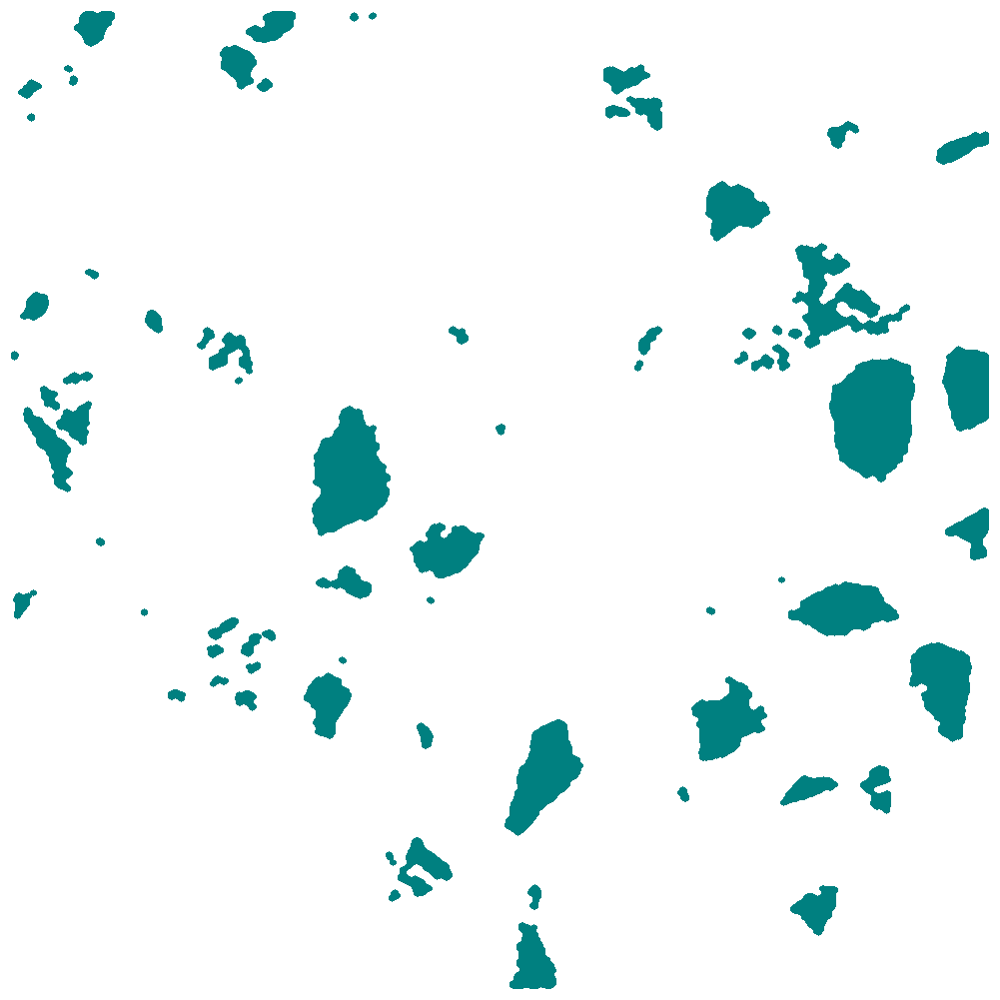

# About Particle extraction、Get Mask、Edge Detection、Image Transpatren、Image Composite and Image Composite

- Edge Detection results

  
  
  

- Paste multiple image results

  
  
  
  
  

# transparen 
convert mask_w_blue.png -fuzz 10% -transparent white a_transparent.png

# merge Merge Multiple Layers of Images into One
convert blue_mask_transparent.png green_mask_transparent.png -transparent white -composite red_mask_transparent.png -transparent white -composite result.png

# pip install doupan
pip install xxx -i http://pypi.douban.com/simple/ --trusted-host pypi.douban.com

pip install -r req.txt -i http://pypi.douban.com/simple/ --trusted-host pypi.douban.com

